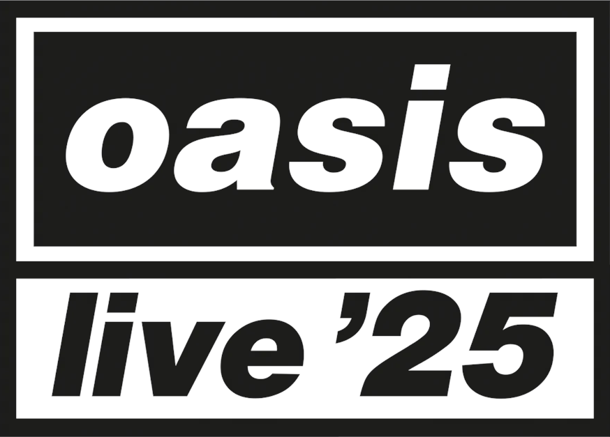

# Oasis Live '25 – Data Visualization

    

As a big fan of the band, I decided to combine business with pleasure and put into practice the knowledge I acquired in data visualization during my [postgraduate studies in Data Science](https://github.com/rodolfo-brandao/pos-graduacao) using public data from Oasis Live '25 World Tour.
