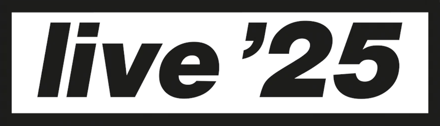

<p align="center">
    
</p>

# Oasis Live '25 – Data Visualization

[](https://github.com/rodolfo-brandao/oasis-live-25-dataviz/blob/main/LICENSE)


[](https://github.com/rodolfo-brandao/oasis-live-25-dataviz/actions/workflows/pylint.yml)

## Overview
As a big fan of the band, I decided to combine business with pleasure and put into practice the knowledge I acquired in data visualization during my [postgraduate studies in Data Science](https://github.com/rodolfo-brandao/pos-graduacao) (pt-BR 🇧🇷) using public data from Oasis Live '25 World Tour.

The final product is an interactive dashboard built and published with [Streamlit](https://streamlit.io/), featuring [Plotly](https://plotly.com/python/) charts that explore:

- Attendance figures
- Estimated revenues
- Concert distribution
- Setlist composition

The dashboard is available at:
- [oasis-live-25](https://oasis-live-25.streamlit.app/)

## Tech Stack
|Tool|Version|Description|
|-|-|-|
|Python|3.14|Core language|
|Pandas|2.3.3|Data loading and transformation|
|Plotly|6.6.0|Interactive chart rendering|
|Streamlit|1.44.0|Dashboard framework and deployment|

## How to Run Locally
#### 1. Clone the repository
```bash
git clone https://github.com/rodolfo-brandao/oasis-live-25-dataviz.git
cd oasis-live-25-dataviz
```

#### 2. Install dependencies
```bash
pip install -r requirements.txt
```

#### 3. Run the dashboard
```bash
streamlit run src/dashboard.py
```

## Project Structure
```
oasis-live-25-dataviz/
├── assets/                         # repo banner and dashboard favicon
├── data/
│   └── oasis_live_25.csv           # tour dataset
├── src/
│   ├── dashboard.py                # Streamlit app entry point
│   ├── charts_factory.py           # all Plotly chart functions
│   └── utils/
│       ├── color_pallet.py         # color system (album + continent palettes)
│       ├── geo_data.py             # country -> continent/flag mappings
│       └── oasis_discography.py    # album/song reference
├── requirements.txt
└── README.md
```

## Regarding the Dataset
[](https://www.kaggle.com/datasets/rodolfobrandao95/oasis-live-25/data)

The dataset present in this repository contains structured information about the Oasis Live ’25 World Tour, the reunion tour by the British rock band in 2025. It compiles detailed data about each concert, including dates, locations, venues, attendance figures, **estimated** revenues, and performed setlists.

Each row represents a single concert from the tour.

It consolidates publicly available information from multiple sources, including official tour announcements, financial reports, and concert setlist archives.

### Contents
The dataset includes information such as:
- Concert dates
- Cities and countries where concerts took place
- Venues
- Number of shows per city residency
- Reported and estimated attendance
- Estimated gross revenue per concert
- Average ticket price (when available)
- Setlists performed during each concert
- Source references used to compile the information

This structure allows analysis on tour both event-by-event and aggregated by city, country, or residency.

### Data Sources
Information in the dataset was compiled from publicly available sources, including:
- Tour date and attendance reports
- Concert financial reports and industry publications
- Concert setlist archives

Each row includes reference fields indicating the source used for the corresponding data (Wikipedia, Poolstar Magazine, setlist.fm).

Primary types of sources include:
- Official tour information
- Concert industry reporting (e.g. Pollstar-style financial summaries)
- Public setlist databases

### Notes on Estimates
Not all concerts have publicly reported financial data or attendance figures. In these cases:
- Attendance values may be estimated from city residency totals
- Gross revenue may be estimated using average ticket price and attendance

Fields describing these estimates are included in the dataset to maintain transparency.

> [!NOTE]
> _The dataset is compiled exclusively from publicly available information and is intended for educational, analytical, and research purposes._
> 
> _All referenced materials remain the property of their respective sources._